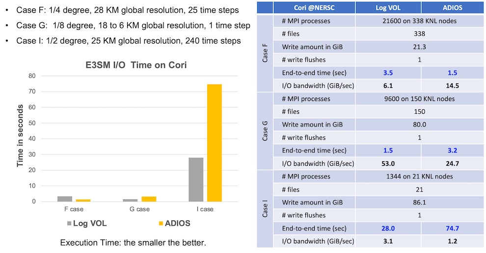
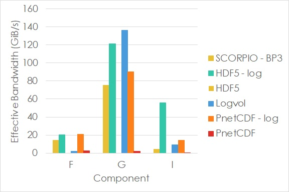

# E3SM-I/O case study

* [Build Instructions](#build-instructions)
* [Run Instructions](#run-instructions)
* [Three cases from E3SM production runs](#three-cases-from-e3sm-production-runs)
* [Performance Results](#performance-results)

This case study uses [E3SM-IO](https://github.com/Parallel-NetCDF/E3SM-IO) to evaluate the
performance of the HDF5 log-layout based VOL, compared with methods using other I/O libraries.
E3SM-IO is an I/O benchmark suite that measures the performance I/O kernel of
[E3SM](https://github.com/E3SM-Project/E3SM), a state-of-the-science Earth system modeling,
simulation, and prediction project. The I/O patterns of E3SM captured by the E3SM's I/O module,
[Scorpio](https://github.com/E3SM-Project/scorpio) from the production runs, are used in the benchmark.

## Build Instructions
* Prerequisite
  + HDF5 1.13.0, required by any HDF5 VOL
  + HDF5 log-layout based VOL version 1.3.0
* Clone E3SM-IO from its github repository:
  ```
    git clone https://github.com/Parallel-NetCDF/E3SM-IO.git
  ```
* Configure E3SM-IO with HDF5 and log-layout based VOL features enabled.
  ```
    cd E3SM-IO
    autoreconf -i
    ./configure --with-hdf5=${HOME}/hdf5/1.13.0 --with-logvol=${HOME}/log_based_vol/1.3.0
  ```
  Full configuration options are available in E3SM-IO's
  [INSTALL.md](https://github.com/Parallel-NetCDF/E3SM-IO/blob/master/INSTALL.md)
* Compile and link
  ```
    make -j 64
  ```
  The executable named `src/e3sm_io` will be created.

## Run Instructions
* Run with HDF5 log-layout based VOL as the I/O method
  ```
    mpiexec -np 16 src/e3sm_io -a hdf5_log -x log -k -o ${HOME}/e3sm_io_log datasets/f_case_866x72_16p.nc
  ```
* Run with HDF5 native VOL as the I/O method
  ```
    mpiexec -np 16 src/e3sm_io -a hdf5 -x canonical -k -o ${HOME}/e3sm_io_native datasets/f_case_866x72_16p.nc
  ```
* The above two commands run the small-scale F case using the data partitioning patterns,
  referred to as `decomposition maps` in Scorpio, generated from a 16-process run. This
  decomposition map file comes with the E3SM-IO, along with two other cases, G and I.
* Information about the decomposition maps is available in
  [datasets/README.md](https://github.com/Parallel-NetCDF/E3SM-IO/blob/master/datasets/README.md)
* Details of comand-line options can be found in the E3SM-IO's
  [INSTALL.md](https://github.com/Parallel-NetCDF/E3SM-IO/blob/master/INSTALL.md#run-command)

## Three cases from E3SM production runs
The E3SM-IO benchmark studies the I/O performance of three E3SM cases. 
* F case - the atmospheric component
* G case - the oceanic component
* I case - the land component.
The F case and the I case produce two history files, referred to as h0 and h1.
The G case produces only one file.

The I/O related information of our evaluations is provided in the table below.
|     Output file                        |     F-H0      |     F-H1     |     G        |     I-H0       |     I-H1     |
|----------------------------------------|---------------|--------------|--------------|----------------|--------------|
|     Number of MPI processes            |     21600     |     21600    |     9600     |     1344       |     1344     |
|     Total size of data written (GiB)   |     14.09     |     6.68     |     79.69    |     86.11      |     0.36     |
|     Number of fixed sized variables    |     15        |     15       |     11       |     18         |     10       |
|     Number of record variables         |     399       |     36       |     41       |     542        |     542      |
|     Number of time records             |     1         |     25       |     1        |     240        |     1        |
|     Number of variables not partitioned|     27        |     27       |     11       |     14         |     14       |
|     Number of variables partitioned    |     387       |     24       |     41       |     546        |     538      |
|     Number of non-contig requests      |     174953    |     83261    |     20888    |     9248875    |     38650    |
|     Number of attributes               |     1427      |     148      |     858      |     2789       |     2759     |

## Performance Results
The performance numbers presented here compare three I/O methods used in E3SM-IO:
the log-layout based VOL, [PnetCDF](https://github.com/Parallel-NetCDF/PnetCDF),
and [ADIOS](https://github.com/ornladios/ADIOS2).

The PnetCDF method stores E3SM variables in files in a canonical storage layout.
For each partitioned variable, each process writes multiple non-contiguous requests.
The PnetCDF's non-blocking APIs are used to enabled request aggregation to improve
performance.
However, storing data in the canonical order requires inter-process communications
in MPI collective I/O, which can be expensive.
Given E3SM's data partitioning patterns containing large numbers of noncontiguous write
requests, the communication cost can be very expensive.
Therefor, it is expected the PnetCDF method performs slower than the log-layout based
VOL, which stores data in the log layout, requiring no inter-process communications.

[Scorpio](https://github.com/E3SM-Project/scorpio) implements an I/O option to use
ADIOS library to write data.
In Scorpio's implementation, each process stores the write data in ADIOS's local
variables by appending one write request data after another.
These local variables are only a collection of data blocks without any ADIOS metadata
describing their logical location.
Instead, Scorpio stores the metadata, such as write data's canonical location, as
additional ADIOS variables, which will be used to convert the BP files to the NetCDF
files later.

### Evaluation on Cori at NERSC
Performance chart below shows the execution time, collected in September 2021, on
[Cori](https://docs.nersc.gov/systems/cori/) at [NERSC](https://www.nersc.gov).
All runs were on the KNL nodes, with 64 MPI processes allocated per node.

Both Log-layout based VOL and ADIOS runs enabled their subfiling feature, which
creates one file per compute node.
The Lustre striping configuration is set to striping count of 8 and striping
size of 1 MiB.

<p align="center">

</p>

### Evaluation on Summit at OLCF
Performance chart below shows the execution time, collected in September 2021, on
[Summit](https://www.olcf.ornl.gov/summit/) at [OLCF](https://www.olcf.ornl.gov/).
All runs allocated 84 MPI processes per node.
Summit's parallel file system, Spectrum file system (GPFS), was used.

<p align="center">

</p>
