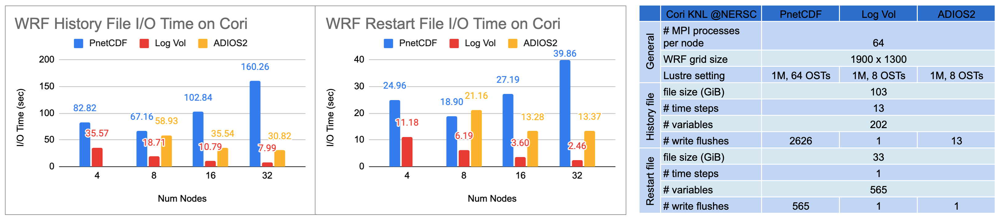

# WRF case study

* [Build Instructions](#build-instructions)
* [Run Instructions](#run-instructions)
* [Three cases from E3SM production runs](#three-cases-from-e3sm-production-runs)
* [Performance Results](#performance-results)

This case study uses [the Weather Research and Forecasting (WRF) Model](https://github.com/wrf-model/WRF) to evaluet the
performance of the HDF5 log-layout based VOL, compared with methods using other I/O libraries.

> The Weather Research and Forecasting (WRF) Model is a state of the art mesoscale numerical weather prediction system designed for both atmospheric research and operational forecasting applications. It features two dynamical cores, a data assimilation system, and a software architecture supporting parallel computation and system extensibility. The model serves a wide range of meteorological applications across scales from tens of meters to thousands of kilometers.
>
> -- <cite>[WRF][1]</cite>


[1]: https://www.mmm.ucar.edu/models/wrf

## Build Instructions
* Prerequisite
  + HDF5 1.13.0 or higher, required by any HDF5 VOL
  + HDF5 log-layout based VOL version 1.3.0
  + netcdf 4.1.3 or higher
  + Jasper-1.900.1 or higher
  + libpng-1.2.50 or higher
  + zlib-1.2.7 or higher
* Clone WRF from its github repository:
  ```
    git clone https://github.com/wrf-model/WRF.git
  ```  
* Setup environment variables for configuring WRF
  ```
    export DIR=${HOME}
    export JASPERLIB=${HOME}/grib2/lib
    export JASPERINC=${HOME}/grib2/include
    export CC=mpicc
    export CXX=mpicxx
    export FC=mpif90
    export FCFLAGS=-m64
    export F77=mpif77
    export F90=mpif90
    export FFLAGS=-m64

    export NETCDF=${HOME}/NetCDF/4.9.0
    export HDF5=${HOME}/HDF5/1.13.2
    export ZLIB=${HOME}/zlib/1.2.7
    export WRF_DIR=${HOME}/WRF

    export NETCDFPAR=$NETCDF_DIR
    export PHDF5=$HDF5

    export CPPFLAGS="$CPPFLAGS -I${JASPERINC} -I$HDF5/include -I$NETCDF/include"
    export LDFLAGS="$LDFLAGS -L${JASPERLIB} -L$HDF5/lib -L$NETCDF/lib"
    export LD_LIBRARY_PATH="$HDF5/lib:$NETCDF/lib:$LD_LIBRARY_PATH"
    export PATH="$HDF5_DIR/bin:$NETCDF_DIR/bin:$PATH"
  ```
* Configure E3SM-IO with NetCDF4 features enabled.
  ```
    cd WRF
    ./clean -a
    ./configure
  ```
  + The WRF configuration is interactive.
    + Select the distributed memory only (dmpar) option that corresponds to the target system.
    + Other options can be left default.
* Compile one of WRF applications  
    + An example compiling the em_les test case
      ```
          ./compile em_les
      ```
    Two executables (ideal.exe, and wrf.exe) will be built under `main` forlder. The two 
    executables should also exist in `test/em_les`, which are linked to those under `main` folder.

* For more details, please refer to [WRF's official compilation tutorial](https://www2.mmm.ucar.edu/wrf/OnLineTutorial/compilation_tutorial.php?fbclid=IwAR3GIOcbAA4rwEjYAeeFDbaywNm4UvHz3CbeXtJbJRIaS9OF03BP5wfX-u8).

## Run Instructions
* Prepare the input data for WRF simulation
  ```
    cd test/em_les
    ./ideal.exe
  ```
* Set HDF5 default VOL to log-layout based VOL
  ```
    source ${HOME}/logvol/1.3.0//bin/h5lenv.bash
  ```
* Run em_les application with log-layout based VOL
  ```
    mpiexec -np 4 ./wrf.exe
  ```

## Performance Results
The performance numbers presented here compare three I/O methods used in WRF:
the log-layout based VOL, [PnetCDF](https://github.com/Parallel-NetCDF/PnetCDF),
and [ADIOS](https://github.com/ornladios/ADIOS2).

WRF write two kinds of outputs: restart files and history files. An history file contain the
simulatioin results for the user selected simulation timesteps. And a restart file serves as
a check point and contains all the necessary information to restart the WRF simulation from a
certain timestep. In our experiments, we produce one history file with 13 timesteps and one
restart file with 1 timestep.

There are 202 variables for an history file's timestep, and there are 565 variables for an
restart file's timestep. Each (large) variable is evenly partitioned among all MPI processes.
WRF makes one write request per variable.

Using PnetCDF, each write request is not made until all previous write requests are served. Using
ADIOS2, write requests are stored internally until the end of each timestep and flush them altogether (so
ADIOS2 flushes 13 times for the history file).
Log Vol also store write requests internally, but only flush once at file close.


### Evaluation on Cori at NERSC
Performance chart below shows the execution time, collected in Sep/2022, on
[Cori](https://docs.nersc.gov/systems/cori/) at [NERSC](https://www.nersc.gov).
All runs were on the KNL nodes, with 64 MPI processes allocated per node.

For PnetCDF, the Lustre file system is configured to use striping count of 64 OSTs
and striping size of 1 MiB.
Both Log-layout based VOL and ADIOS runs enabled their subfiling feature, which
creates one file per compute node.
The Lustre striping configuration is set to striping count of 8 OST and striping
size of 1 MiB



