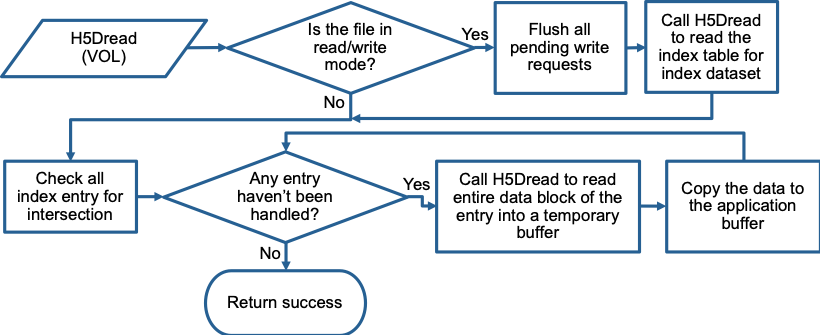
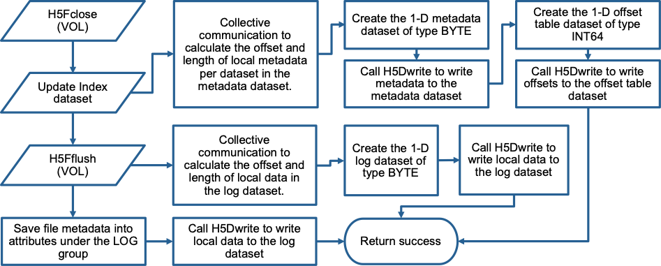

## Design of Log-based Virtual Object Driver in HDF5
### 1. Introduction
This document describes the design of a new virtual object driver in HDF5 [1]
that stores data in a log-based layout. The goal is to improve the parallel I/O
performance for large-scale applications on ECP platforms. Storing data in
log-based layout in files has been known in parallel I/O community that can
defer the expensive inter-process communication to later I/O stage [2,3]. The
inter-process communication costs are required in MPI collective I/O
operations, if the data stored in files requires to be in a canonical order. As
the scale of supercomputers grows, such costs are expected to increase and
become a performance bottleneck for parallel applications. To avoid such
communication, HDF5 provides a feature called "data chunking" to allow
users to store data in a sequence of chunks, appending one data chunk after
another in the file. It employs an internal B-tree based indexing mechanism to
keep track of chunk locations. Although the canonical order is no longer
required, it is still enforced within individual chunks. While this feature has
demonstrated to improve I/O performance for many applications in the past, we
found that it fails to produce similar improvement for I/O patterns consisting
of a high volume of noncontiguous and irregular I/O requests, such as the
pattern exhibited in E3SM [4]. HDF5's requirement on equal-sized data
chunks prevents E3SM from taking advantage of this feature to eliminate the
inter-process communication.

In the latest HDF5 development, an abstraction layer named the Virtual Object
Layer (VOL) is incorporated into the HDF5 library that provides advanced users
a way to customize their I/O operations by supplying an I/O driver as a plug-in
library module that can be developed independently from HDF5 and linked
together with the native HDF5 libraries.  When HDF5 applications call the HDF5
APIs, the VOL transparently redirects the calls to the plug-in I/O driver. With
such virtual software layer, the idea of log-based storage layout can be
implemented, allowing us to bypass the HDF5's fixe-sized chunking limitation.
Our log-based I/O driver will be developed by following such VOL mechanism. Our
goal is to provide existing HDF5 applications an option to store data in an
alternative layout in files for better I/O performance with minimal changes to
their source codes.

### 2. HDF5 Virtual Object Layer
The VOL is an abstraction layer in the HDF5 library that intercepts all API
calls for accessing objects in an HDF5 container and forwards those calls to
the plugin 'object drivers'. HDF5 provides a native plugin that performs I/O as
defined in the standard HDF5 specifications. Users can also develop customized
plugins and linked them to HDF5 libraries through VOL. A plugin can store data
in a file format different from HDF5, alter API semantics of HDF5 APIs, or
store objects in a different file layout. The availability of VOL makes HDF5
APIs become a universal interface to various data containers, file formats, and
data models.

### 3. Design of Log-based Virtual Object Driver
Our design principle for the log-based driver is to store I/O requests
contiguously in files, like logs appending one after another. Such strategy
avoids the potentially high costs of inter-process communication required if
data is to be stored in a canonical order. The log-based driver includes
mechanisms to keep track of the metadata of individual logged requests and
manage them for other requests. The driver will be developed separately from
the HDF5 source tree and compiled into a stand-alone library file. The library
can then be linked together with the native HDF5 library when building a user
program. Once the library is linked and registered by the user programs, the
HDF5 VOL intercepts a subset of relevant I/O functions and redirects them to
the log-based driver. The design of relevant I/O functions will be described
with further details in later sections.

The files created by the log-based driver will be valid HDF5 files. They will
conform with HDF5 file specification and thus can be recognized by existing
HDF5 programs. However, the high-level structures of objects stored in the file
may not be the same as traditional HDF5 files. The log-based driver will be
required to reconstruct the metadata into the views understood by the HDF5
conventions. Auxiliary data objects will be created to support the log layout,
which will be stored as regular HDF5 objects, such as datasets and attributes.
These auxiliary data objects will be stored in a special group and accessed
through the native HDF5 functions.

In order to increase the performance for write operations, we adjust the
semantics of write APIs to be nonblocking and require users to call a flush API
explicitly to commit the requests to files. This adjustment allows the
log-based driver to aggregate small requests into large ones for better I/O
bandwidths and reduce frequency of inter-process communication cost when
flushing data in parallel.

### 3.1. Internal Representation of Dataset Objects
In the log-based driver, a traditional HDF5 dataset is represented by a scalar
dataset with its dimension information stored as the scalar variable's
attributes. We refer to this scalar dataset as the 'anchor dataset'.  The
contents of a dataset is stored in a 1D dataset of unsigned byte type, referred
as the 'log dataset'. Each time a write request is made to the dataset, the
request contents are appended to the end of log dataset as a contiguous block.
The space of log dataset is shared by all datasets and stores data following
the same timely sequence of write requests made by the application. A unique
internal ID is assigned to each traditional dataset in order to identify all
its requests stored in the log dataset.

Ideally, the log dataset is expandable in size and to be stored contiguously in
file for best write performance. In HDF5, a dataset to be stored in a
contiguous space in files must be defined with fixed dimension sizes. On the
other hand, an expandable dataset must use the chunked storage layout which
does not guarantee chunks are stored contiguously in files. Due to this
limitation, the log datasets in our design are defined as fixed-size datasets.
A log dataset is created when file flush is called. Without using data
chunking, this allows us to avoid potentially expensive B-tree metadata
operations, an indexing data structure employed by HDF5 to keep track of the
locations of chunks in files.

A new group is created at the root level to store all auxiliary data objects
created by our log-based driver. The group is referred as 'log group'.  The
most important members of this group are the log datasets, which are
one-dimensional arrays of type H5T_STD_U8LE (unsigned 8-bit type in Little
Endian format). Log datasets store only the write request data. Other new
datasets are created in the log group are for storing the log metadata.

### 3.2.  Log Metadata
To allow efficient searching of write requests in log datasets, we create two
auxiliary datasets as metadata tables. The first table is a one-dimensional
array of type H5T_STD_U8LE, stored in HDF5 chunk layout with an unlimited
dimension to allow expansion when new write requests are logged. Each element
of this table is of a compound data type that stores the metadata of a write
request. The format specification of the compound data type is provided in the
Appendix. The reason we define the dataset of type H5T_STD_U8LE is because each
element can be of different size, depending on the number of dimensions of the
original datasets. The table will be parsed by the log driver to store and
retrieve individual elements. This table is referred as the 'log metadata
table', or simply 'metadata table', which is shared by all datasets
and its entries are sorted based on the increasing order of dataset IDs.

The second dataset is a look-up table, which stores the starting offsets of
datasets in the metadata table. It is referred as the 'offset table' and can be
used to skip unrelated datasets when searching and reading log entries. The
offset table is a one-dimensional array of type H5T_STD_U64LE (unsigned 64-bit
integer in Little Endian form). It uses the HDF5 chunk storage layout with an
unlimited dimension. The two datasets are created when calling file flush or
close. They can also be used to convert the files in logged data layout into
the traditional HDF5 canonical layout. Such conversion is usually carried out
by an off-line utility program.

#### 3.2.1.  Proposed change to metadata table - caching the metadata
An alternate approach is to organize the metadata only in memory.
The metadata in the file is unorganized (unsorted), and there is no look-up
 table for the starting offsets of datasets in the metadata table.
When a file is opened, we read and cache all metadata entries in the memory.
Then, we can organize the metadata using whatever data structure we like.
A straightforward data structure is to organize the metadata entries into bins.
Each bin contains entries related to a dataset. It achieves the same effect as in our original design.
We can also utilize more complex data structures, such as R-tree, to improve read performance.

On every flush, we use MPI_Allgather to distribute new metadata to every process.
Each process individually updates its own in-memory data structure with incoming change.
When the file is close, the structured metadata is flattened and written
to the metadata dataset.

### 4.  APIs Implemented in the Log-based Virtual Object Driver
This section describes the APIs to be implemented by the log-based driver,
including file open and close, dataset open, create, read, write, and close.
Other HDF5 APIs that are not intercepted by the driver are passed to the native
VOL driver.

### 4.1.  File Create
The log-based driver uses an internal data structure to store the file
metadata. The metadata will be used to connect the object handles used in the
log driver and the HDF5 native driver. The members of this data structure
include:
* File object returned by the native driver
* An array of pointers to the pending I/O requests
* Log metadata table
* Log index table
* Log offset table

When H5Fcreate is called, the log driver first calls the native driver to
obtain the file ID, followed by creating the log group under the root level to
accommodate the auxiliary datasets for storing the metadata and raw data of
user write requests. Two attributes are created and associated to the log
group. One is a scalar attribute of type integer to store the number of user
datasets created in the file. The other is a scalar storing the number of log
datasets. Note the log datasets refer to the datasets created by the log-based
driver to store the write requests in the log fashion. In addition to log
datasets, there are two tables will be added to the log group. Because their
sizes will not be known before flushing the logged data dataset, their creation
is delayed until the first file flush call.

### 4.2.  File Open
To open a file that was previously created by the log driver, the log driver
first calls H5Fopen to open the file using the native driver. It then continues
to open the log group, its attributes, and the metadata tables. Once opened,
these auxiliary data objects are read into memory buffers.

### 4.3.  Dataset Create
When API H5Dcreate is called, the log driver first calls the native driver to
create a scalar dataset, referred as the 'anchor dataset'. The anchor dataset
will be used to store other HDF5 objects associated to it, such as attributes
added by user programs. Such operations will be done through the native driver
using the anchor dataset's ID.

### 4.4.  Dataset Open
When API H5Dopen is called, the log driver calls the native driver to open the
anchor dataset and populates the auxiliary objects in memory by reading them
from the file.

### 4.5.  Dataspace Query
The dataspace of a dataset is stored as its attribute. The log driver
intercepts the call to H5Dget_space and creates a new HDF5 dataspace object
using the native driver. It then retrieves the dataset's dimensionality from
the dataspace attribute and returns the dataspace object.

### 4.6.  Dataset Write
In HDF5, users can specify the way how a dataset is written to the file, by
using an HDF5 data transfer property. For example, predefined constants
H5FD_MPIO_COLLECTIVE or H5FD_MPIO_INDEPENDENT can be used to tell HDF5 to use
MPI collective or independent I/O functions underneath to transfer data to the
file system. Users can also create their own property class through API
H5Pregister2 to define customized properties.

Performance of our log-based driver can be significantly enhanced if the
multiple small I/O requests can be aggregated into fewer, large request. There
are two approaches to achieve the effect of request aggregation.
1. One is to buffer the write requests internally and later the buffered
   requests are aggregated and flushed together. This approach allows users to
   re-use their I/O buffers immediately after the write requests return. The
   side effect is the increasing memory footprint of the log-based driver.
2. The other approach is non-blocking I/O. A new HDF5 data transfer property
   will have to be defined to introduce a new I/O semantics that limit users
   from altering the buffer contents before the pending requests are flushed to
   the file system. Such non-blocking APIs appear in MPI and PnetCDF.

Our log-based plugin driver will implement the first approach and the second
approach in the later stage. For each write request, the log driver copies the
data into a temporary allocated buffer. This internal buffer will be freed
after the request is flushed to the file. Once the write request API H5Dwrite
returns, users are free to modify the buffer contents. Users are noted that the
write data can only be considered secured (in disk) after the flush API is
called. The space limit of the internal buffers can be set by users through the
file access property list. The space limit is shared by all the datasets
defined in the file. When the limit is reached, the write API returns an error
with a message properly defined through HDF5 error handling mechanism. The
error can be used to determine whether to call flush APIs. It is the user's
responsibility to ensure the set buffer size is large enough for their need. In
our design data flushing is only performed in file flush and close APIs. File
flush and close APIs are collective because log metadata must be synchronized
and thus requires the participation of all processes.

The size of the buffer used by the log driver to cache data can be configured
by the user in the file access property list. Space is shared by all datasets
in the file. If there is not enough space to cache incoming data, the write
operation will fail. It is the user's responsibility to ensure the set buffer
size is large enough for their need. For now, we do not consider flushing the
buffer automatically because it will require participation from all processes
and involves additional communication overhead.

As for the non-blocking approach, a new data transfer property class for
nonblocking I/O will be introduced and users can call property set API to
indicate a call to H5Dwrite is non-blocking.  When non-blocking transfer
property is used, API H5Dwrite acts as an API that posts a pending request. All
pending write requests are later flushed by an explicit call to file flush API.
Users are required to keep the contents of write buffers unchanged until the
flush is called. The metadata of a pending write request includes dataset ID,
hyperslab selection, pointer to the user buffer, etc. Metadata of multiple
write requests will be used to aggregate the requests during the file flush
call. Figure 1 shows the workflow of the log driver handling the write request.

<p align="center">

<br><br>
Figure 1. Workflow of H5Dwrite, writing to a dataset.
</p>

### 4.7.  Dataset Read
To read a dataset, the log driver searches the metadata tables for any logged
requests that intersect with the hyperslab selection of the read request. For
each intersected log, the entire log data is read into a buffer and then the
intersected part is copied over to the user buffer. During the intersection
check, the metadata log entries are visited in the order of their creation so
that the requests written in the later time will overwrite the previous ones.
This design essentially follows the sequential consistency semantics used in
POSIX I/O. If the file is opened in read/write mode, a call to flush any
pending write requests is required prior to the read to ensure data consistency
among processes. The flow chart below depicts the steps the log driver handle
read requests. Figure 2 shows the workflow of H5Dread.

<p align="center">

<br><br>
Figure 2. Workflow of H5Dread, reading from a dataset.
</p>

### 4.8.  Dataset Flush
API H5Dflush flushes the pending write requests for a dataset. In HDF5
semantics, all pending requests to the dataset will be flushed to the file. In
our design, write requests are associated with a temporal stamp (or a sequence
ID) so the data can be stored in a log structure. Our log driver will expand
this API to flush all the pending requests for all datasets, in order to
maintain such log structure. In our design, calling H5Dflush is equivalent to
calling H5Fflush, which flushes all objects of a file.

### 4.9.  Dataset Close
When API H5Dclose is called, the log driver calls the native driver to close
the anchor dataset. Note the pending write requests are not flushed at this
time.

### 4.10.  File Flush
Flushing the pending write requests is a collective operation. Each process
first calculates the aggregated size of all locally pending requests. A call to
MPI_Exscan by all processes can obtain the starting offsets to the log dataset
for each process. The starting offsets are used to create a hyperslab
selection, which is later used when calling H5Dwrite. Another call to
MPI_Allreduce is also required to obtain the total size of write size across
all processes. The size is used to defined the size of the log dataset. Figure
3 depicts the workflow for H5Fflush and H5Fclose.

A new log dataset is created under the log group each time file flush is
called. The names of log datasets will include a sequence number representing
the timely order of their creation.

Writing the log datasets to file is carried out by calling the native driver
with file space properly calculated. All writes are collective.

Writing the metadata tables to file is delayed until a read request is made or
when closing the file. Log metadata of all flushed requests is kept in the
memory, so it can be used to construct the tables right before written to the
file. Each entry in the log metadata contains the information about log dataset
ID and offset, so individual write requests can be uniquely identified.

<p align="center">

<br><br>
Figure 3. Workflow of H5Fflush and H5Fclose, file flushing and close, respectively.
</p>

### 4.10.1.  Metadata Table Generation
There are two tables stored under the log group: the metadata table and the
offset table. The metadata table stores the metadata of all the write requests.
Before flushing the table to file, the IDs of all entries may appear to be
repeated and unsorted, as the write requests can be made in an arbitrary order.
The table is first sorted locally in each process into a monotonically
nondecreasing order of dataset IDs. The metadata table is then used to
construct the offset table. The offset table stores the starting offsets to
entries in the metadata table.

Both tables are then aggregated across all processes before written to the
file. The metadata tables from individual processes are appended in the file
based on the order of MPI process ranks. Similarly, the offset table also
stores the offsets in the increasing order of process ranks. MPI collective
communication such as MPI_Exscan and MPI_Allreduce are required to obtained
write offsets and lengths for each MPI process before writing the tables.

Both tables are one-dimensional HDF5 datasets using chunk layout with the
dataspace property of an unlimited dimension. Since they are created by HDF5's
native driver, their sizes must be set by calling API H5Dset_extent to expand
their sizes each time more requests are added.

When writing the tables to file, a collective call to H5Dwrite using the native
HDF5 driver is made. Properties of hyperslab selection on each MPI process must
be defined using the offsets and lengths calculated earlier. Note because each
process may write to multiple non-contiguous locations of the dataset in file,
the call to H5Sselect_elements may be used to select a sequence of hyperslabs
in the HDF5 data space.

### 4.11.  File Close
The log driver checks and flushes all pending requests to the log datasets. All
log attributes are updated and also written to file. If any auxiliary dataset
objects have not been created yet, they are created with the current sizes,
before written to file. At the end, the log driver calls the native driver
close API to close the file.

### 5.  References
1. Mohamad Chaarawi. 'User Guide for Developing a Virtual Object Layer
   Plugin,' The HDF Group, January 12, 2018.
2. D. Kimpe, R. Ross, S.  Vandewalle, and S. Poedts, 'Transparent log-based
   data storage in MPI-IO applications,' in the European Parallel Virtual
   Machine/Message Passing Interface Users' Group Meeting. Springer, 2007, pp.
   233-241.
3. M. Polte, J. Lofstead, J. Bent, G. Gibson, S. A. Klasky, Q. Liu, M.
   Parashar, N. Podhorszki, K. Schwan, M. Wingate et al., 'High read
   performance in write-optimized HPC I/O middleware file formats,' in
   Proceedings of the 4th Annual Workshop on Petascale Data Storage. ACM, 2009,
   pp. 21-25.
4. 'Energy Exascale Earth System Model (E3SM)', https://github.com/E3SM-Project/E3SM.

### Appendix A. Format of Log Metadata Table
The log metadata table is defined as an HDF5 dataset of type H5T_STD_U8LE
(unsigned byte in Little Endian format). It is a byte stream containing the
information of all write requests logged by the log driver. Below is the format
specification of the metadata table in the form of Backus Normal Form (BNF)
grammar notation.
```
metadata_table		= signature endianness var_list entry_list

signature		= 'L' 'O' 'G' VERSION
VERSION			= \x01
endianness		= ZERO |	// little Endian
			  ONE		// big Endian

var_list		= nelems [var_name ...]
nelems			= INT64		// number of element(s)
var_name		= name
name			= nelems CHARACTER_STRING

entry_list		= nelems [entry_off ...] [entry_len ...] index_table
entry_off		= INT64		// starting file offset of an entry
entry_len		= INT64		// byte size of an entry
					// entry_off and entry_len are pairwise

index_table		= [entry ...]	// log index table
entry			= dsetid filter data_loc selection_type selection
					// A log entry contains metadata of
					// write requests to a dataset. One
					// dataset may have more than one
					// entry.
dsetid			= INT64		// dataset ID as ordered in var_list
filter			= NONE | ZLIB	// compression capability
data_loc		= INT64		// starting file offset storing the
					// logged dataset contents
selection_type		= SUBARRAY | POINT
SUBARRAY		= ZERO
POINT			= ONE

selection		= subarray_selection | point_selection
					// file data layout of a log entry
subarray_selection	= nelems [start ...] [end ...]
point_selection		= nelems [start ...]
start			= INT64		// starting flattened subarray index
end			= INT64		//   ending flattened subarray index
					// starts and ends are pairwise

NONE			= ZERO
ZLIB			= ONE
TRUE			= ONE
FALSE			= ZERO
BYTE			= <8-bit byte>
CHAR			= BYTE
INT32			= <32-bit signed integer, native representation>
INT64			= <64-bit signed integer, native representation>
ZERO			= 0	// 4-byte integer in native representation
ONE			= 1	// 4-byte integer in native representation
TWO			= 2	// 4-byte integer in native representation
THREE			= 3	// 4-byte integer in native representation
```

